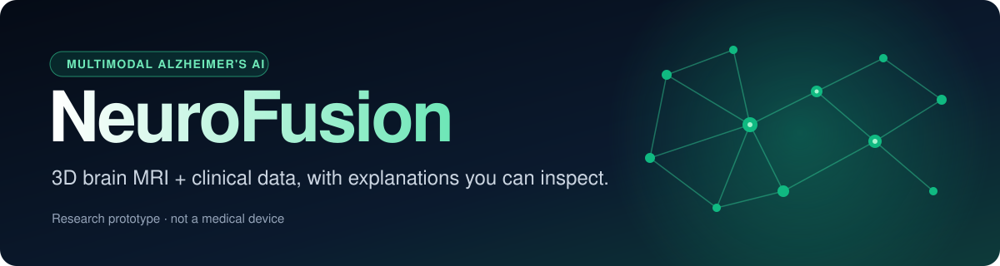
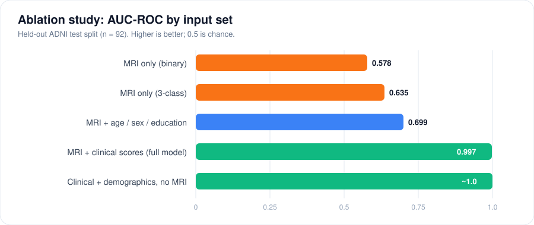
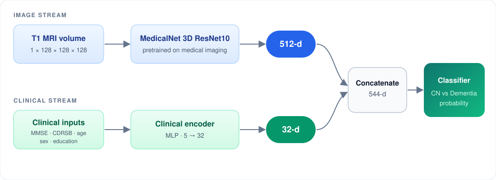
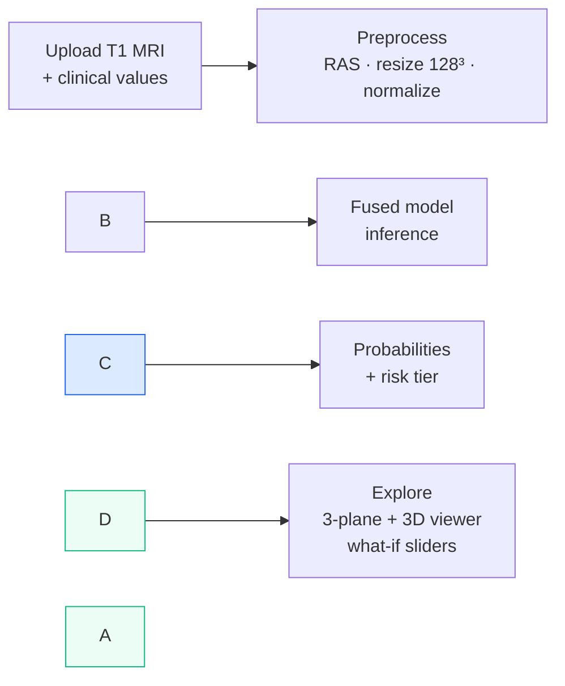

<div align="center">



<br/>


[**Overview**](#-overview) **·** [**Results**](#-results) **·** [**Architecture**](#-architecture) **·** [**Features**](#-features)  **·** [**Limitations**](#️-limitations)

</div>

<br/>

> \\\[!WARNING]
> \\\*\\\*Research prototype, not a medical device.\\\*\\\* NeuroFusion must not be used for diagnosis, treatment, or any clinical decision.

<!-- TODO: add a screenshot or demo GIF here -->

<!-- <p align="center"></p> -->

\---

## 🧠 Overview

NeuroFusion fuses a **3D structural brain MRI** with **clinical data** to classify a person as cognitively normal (CN) or dementia. A pretrained 3D ResNet encodes the scan, a small encoder handles the clinical values, and a fusion classifier combines them. An interactive web app lets you upload a scan, explore it in three planes and in 3D, change the inputs, and see what drives the prediction.

<table>
<tr>
<td width="33%" valign="top">

### 🔀 Fuse

MRI features and clinical scores (MMSE, CDRSB, age, sex, education) combined in one model.

</td>
<td width="33%" valign="top">

### 🔍 Visualize

Axial, coronal, and sagittal slices with a synced crosshair, plus an interactive 3D brain.

</td>
<td width="33%" valign="top">

### 💡 Explain

An honest ablation shows what the scan adds and what the clinical scores add.

</td>
</tr>
</table>

### Why it's different

Most Alzheimer's AI tools report one accuracy number. NeuroFusion also shows **what each input contributes**. The ablation study found that clinical scores drive most of the performance, while MRI plus demographics alone reaches only AUC 0.70. This project reports that finding openly.

\---

## 📊 Results

Evaluated on a single held-out ADNI test split (**n = 92**: 70 CN, 22 dementia).

<div align="center">

|🎯 AUC-ROC|✅ Correct|🟢 CN recall|🔴 Dementia recall|
|:-:|:-:|:-:|:-:|
|**0.997**|**89 / 92**|**100%**|**86.4%**|
|95% CI 0.935-1.000|single split|70 of 70|19 of 22|

</div>

<p align="center">
  
</p>

> \\\[!IMPORTANT]
> \\\*\\\*Key finding:\\\*\\\* clinical scores do most of the work. A simple model on MMSE, CDRSB, and demographics alone matches the full multimodal model on this split, and the imaging contribution is modest. Confidence intervals are wide because the test set is small.

\---

## 🏗 Architecture

<p align="center">
  
</p>



|Component|Details|
|-|-|
|**Image stream**|MedicalNet 3D ResNet10, pretrained on medical imaging, outputs 512-d features|
|**Clinical stream**|MLP encoder, 5 inputs to 32-d|
|**Fusion**|Concatenation (512 + 32 = 544-d), then a classifier head|
|**Output**|CN vs Dementia probability|

\---

## ✨ Features

* 📤 **NIfTI upload** with validation and pseudonymized sample patients
* 🧭 **Multi-planar viewer** with axial, coronal, and sagittal slices and a synced crosshair
* 🧊 **Interactive 3D brain** reconstruction (surface and volume modes)
* 📈 **Probabilities and risk tier** with a plain-language explanation
* 🎚 **What-if clinical sliders**: same scan, change MMSE or CDRSB, watch the prediction move
* 📉 **Interactive charts** for the ablation study and per-class performance

<!-- Add ONLY the features that work in the code:
- 🔥 MRI explainability heatmaps (Sensitivity, Guided Backprop, Occlusion, Area Occlusion)
- 🎯 Adjustable classification threshold with sensitivity/specificity
- 🗺 Representation map of learned features
- ⏳ Temporal risk projection (12 / 24 / 36 months, labeled as a projection)

\\---

## 🗂 Data

|||
|-|-|
|\*\*Dataset\*\*|\[ADNI](https://adni.loni.usc.edu/) (ADNI1): 559 subjects, 330 in the CN vs Dementia subset|
|\*\*Scans\*\*|T1-weighted MPRAGE, baseline visit, NIfTI|
|\*\*Preprocessing\*\*|RAS orientation, resize to 128³, intensity normalization (nibabel + MONAI)|

> \\\[!NOTE]
> \\\*\\\*ADNI data is not included in this repository.\\\*\\\* See \\\[`DATA.md`](DATA.md) for how to request access.

\\---

## 🛠 Tech stack

<div align="center">

|Layer|Tools|
|:-:|-|
|\*\*Model\*\*|PyTorch · MONAI · MedicalNet|
|\*\*Data and evaluation\*\*|nibabel · scikit-learn · Weights \\\& Biases|
|\*\*Backend\*\*|FastAPI · Pydantic|
|\*\*Frontend\*\*|React · TypeScript · Tailwind CSS · Recharts · three.js|

</div>

\\---

## 🚀 Quick start

<details open>
<summary><b>1. Backend</b></summary>

```bash
cd backend
python -m venv .venv
# Windows: .venv\\\\Scripts\\\\activate     macOS/Linux: source .venv/bin/activate
pip install -r requirements.txt
uvicorn app.main:app --reload --port 8000
```


</details>

<details open>
<summary><b>2. Frontend</b></summary>

```bash
cd frontend
npm install
npm run dev
```

Create `frontend/.env`:

```
VITE\\\_API\\\_URL=http://localhost:8000
```

</details>

<details>
<summary><b>3. Model weights</b></summary>

Place the trained weights file in `backend/weights/`, or set the environment variable described in `.env.example` to download them at startup.

<!-- TODO: state the exact filename and where the weights are hosted -->

</details>

\---

## 📁 Repository structure

<!-- Adjust to match your actual folders -->

```
NeuroFusion/
├── backend/        FastAPI inference service
├── frontend/       React + TypeScript web app
├── research/       Training and evaluation code
├── analysis/       Evaluation scripts and result summaries
├── docs/           Images and documentation
├── DATA.md         How to obtain ADNI data
└── README.md
```

\---

## 🔒 Privacy

Uploaded scans are processed in memory or temporary storage and are not kept permanently. No ADNI data, scans, or subject-level files are included in this repository.

\---

## ⚠️ Limitations

* Performance is driven largely by clinical scores (MMSE and CDRSB); the MRI adds modestly
* Small dataset (330 binary subjects) and a single train/test split, so confidence intervals are wide
* Baseline visits only, so progression over time is not modeled
* Trained on ADNI1; performance on other scanners, sites, or populations is untested
* Not clinically validated. **Not a medical device.**

\---

## 🗺 Roadmap

* \[ ] Repeated cross-validation and external validation (for example on OASIS-2)
* \[ ] Time-to-event progression modeling with ADNI follow-up data
* \[ ] Brain-region segmentation (hippocampus, ventricles) in the 3D view
* \[ ] Calibration analysis and feature-importance reporting

\---

## 📚 Research history

This project builds on an earlier research repository: [alzheimer-mri-progression](https://github.com/ArinehKhachikian/alzheimer-mri-progression). The experimental path included a DenseNet121 trained from scratch (overfit), MedicalNet transfer learning, imaging-only binary classification, and multimodal fusion.

\---

## 🙏 Acknowledgements

* Data used in this project were obtained from the **Alzheimer's Disease Neuroimaging Initiative (ADNI)** database. ADNI investigators contributed to the design and implementation of ADNI but did not participate in the analysis or writing of this work.
* Pretrained weights: **MedicalNet / Med3D**. Chen, S., Ma, K., Zheng, Y. *Med3D: Transfer Learning for 3D Medical Image Analysis.* arXiv:1904.00625.

\---

&#x20;👥 Team


NeuroFusion was designed and built by Team CODEVITALS:


<div align="center">


<h3>🧬 CODEVITALS</h3>


<table>

<tr>

<td align="center" width="50%">

<br/>

<h3>Abhinand C Varghese</h3>

<a href="https://github.com/abhinandofficial"></a>

<br/><br/>

</td>

<td align="center" width="50%">

<br/>

<h3>Varun G</h3>

<!-- TODO: add Varun's GitHub badge, for example:

<a href="https://github.com/varung-coder"></a> -->

<br/><br/>

</td>

</tr>

</table>


</div>


Team CODEVITALS · Built for the YODHA Hackathon.


\---


## 📄 License

Released under the [MIT License](LICENSE). ADNI data and MedicalNet weights are subject to their own terms of use.

<div align="center">

<sub>NeuroFusion is a research and educational prototype. It is **not** a medical device and must not be used for clinical decisions.</sub>

</div>

